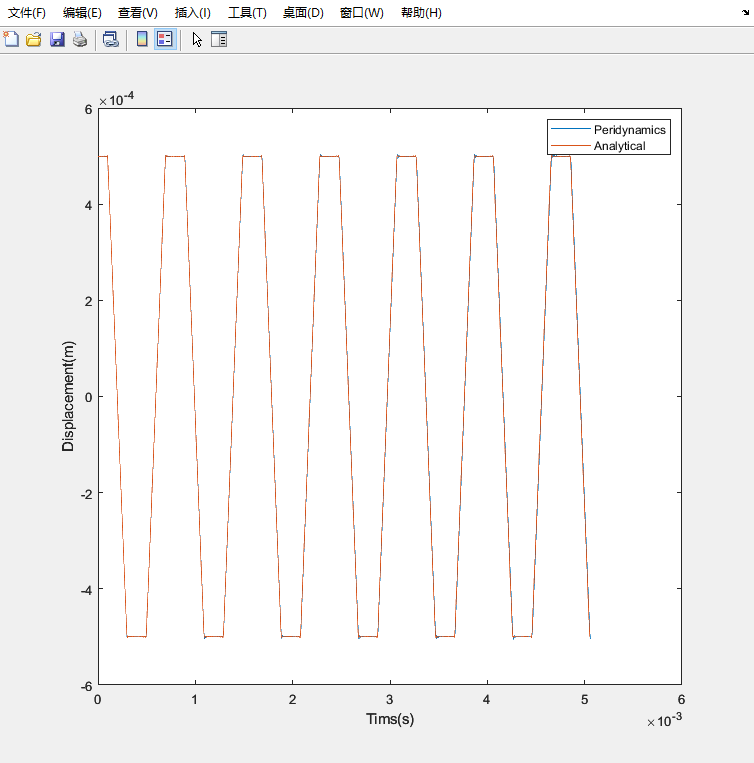
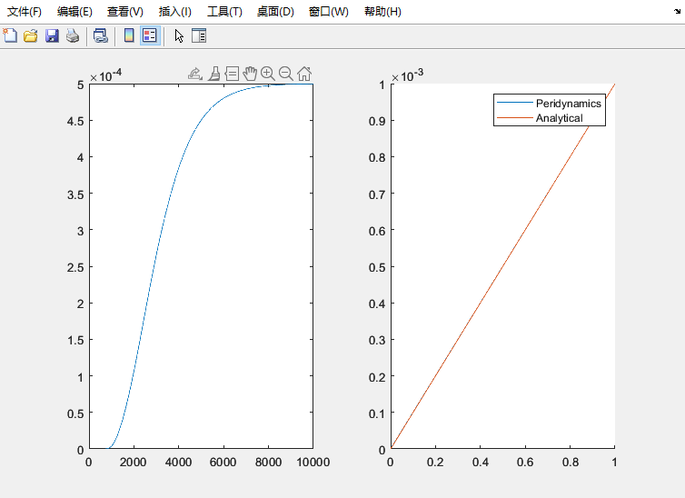
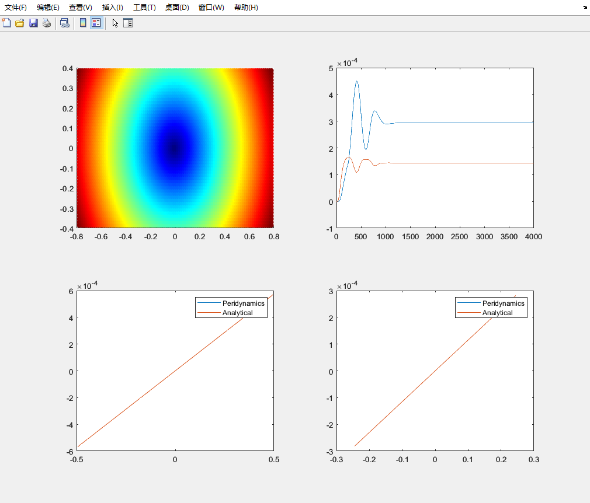
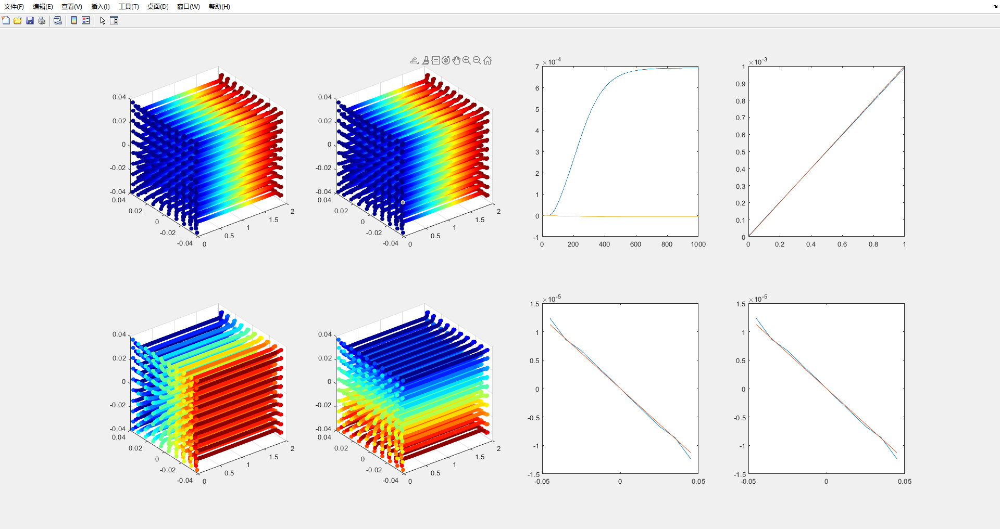
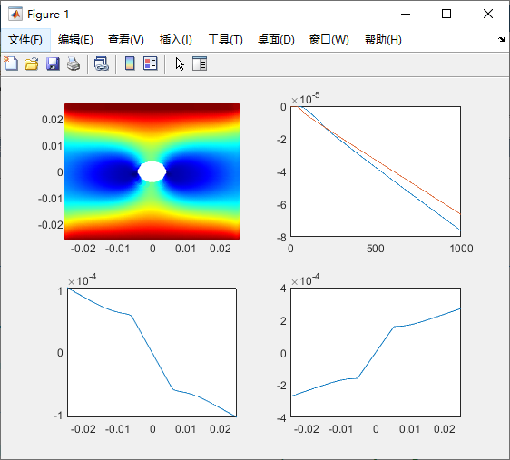
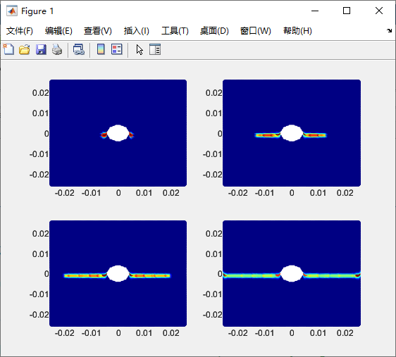
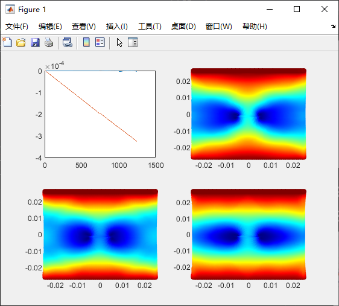
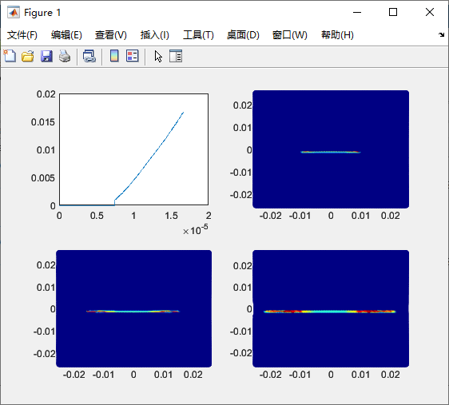
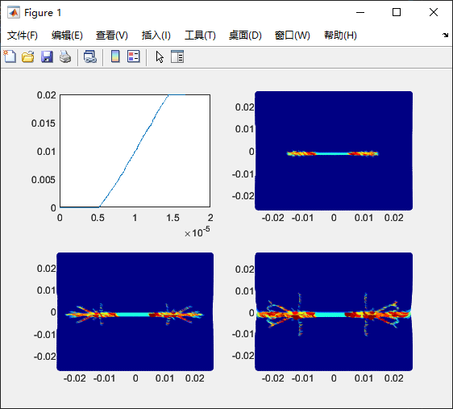

# Matlab Peridynamics Code
Translation of Fotran codes in book Peridynamic Theory and Its Applications (Erdogan Madenci, Erkan Oterkus) into a MATLAB version.  

Results are as following:
## 8.1 Longitudinal Vibration of Bar

## 8.2 Bar Under Tension

## 8.3 Isotropic Plate Under Uniaxial Tension or Uniform Temperature Change

## 8.5 Block of Material Under Tension

## 9.1 Plate with a Circular Cutout Under Quasi-Static Loading

## 9.2 Plate with a Pre-existing Crack Under Velocity Boundary Conditions

